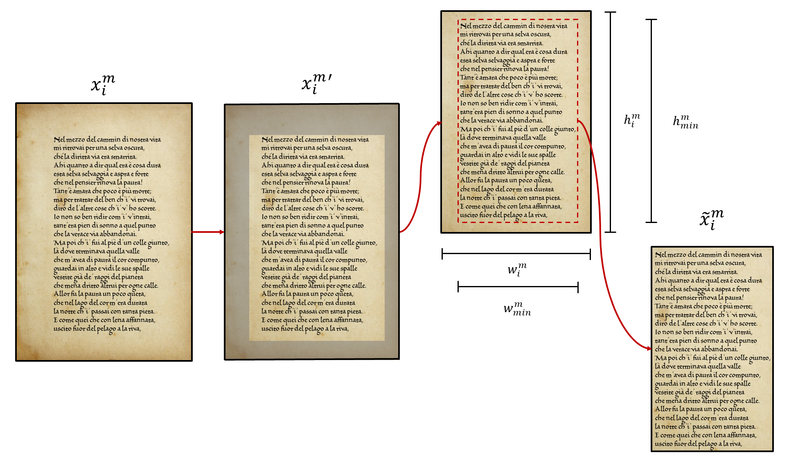

# Self-supervised learning for handwriting identification on medieval manuscripts
This repository allows the user to solve the task of handwriting identification for medieval manuscripts (via minimization of a triplet margin loss) either by:
* fine-tuning a ResNet18 encoder pretrained with
[OBoW: Online Bag-of-Visual-Words Generation for Self-Supervised Learning](https://openaccess.thecvf.com/content/CVPR2021/papers/Gidaris_OBoW_Online_Bag-of-Visual-Words_Generation_for_Self-Supervised_Learning_CVPR_2021_paper.pdf) on a set of unlabeled manuscripts;
* or fine-tuning a ResNet18 encoder pretrained on the ImageNet dataset;
* or even training a ResNet18 completely from scratch.  

Among the three different options, the first one - which relies on self-supervised pretraining - not only significantly outperforms the other two for the background set (consisting of authors or copyists used to fine-tune the model), but also shows higher generalization power, as confirmed by the performance on the evaluation set (consisting of authors never seen during the downstream task).
## Contents
1. [Dataset](#dataset)
2. [Installation](#installation)
3. [Test configuration](#test-configuration)
4. [Usage](#usage)
5. [Model weights](#model-weights)
6. [TensorFlow Embedding Projector](#tensorflow-embedding-projector)
7. [License](#license)
## Dataset
The handwriting identification task was carried out on 24 manuscripts scraped at the highest resolution available from the [Vatican Apostolic Library](http://www.mss.vatlib.it/guii/scan/link1.jsp?fond=Vat.lat.). The following manuscripts were considered: 
* **graphic particularism**: Vat.lat.3313, 5951, 9882 (IX century), 3317 (X century), 4958, 12910 (XI century), and 4939 (XII century);
* **Carolingian minuscule and Gothic minuscule**: Vat.lat.43, 3868, 4965, 5775 (IX century), 378, 579, 653, 8487 (XI century), 42, 620, and 3833 (XII century);
* **Gothic minuscule**: 907, 2669 (XIII century), and 588 (XIV century);
* **additional manuscripts**: 4217 (XI century), 4220, 4221 (XVI century). 

All the manuscripts underwent the following preprocessing stage:
* the unnecessary pages (for example, unwritten pages, pages containing too many drawings, or pictures of the manuscript cover) were removed;
* to prevent the unwritten borders of the pages from being included in the pipeline, each image was cropped to match a given size (constant across all the manuscript).
<p align="center">
    
</p>
The whole set of pages was used for self-supervised pretraining. For the handwriting identification task, instead, only the annotated pages (corresponding to 31 different authors) were selected from the overall corpus.

Due to copyright issues on the original images, the preprocessed dataset (together with the annotations and the script to generate the background and evaluation sets) is only available upon request.
## Installation
To setup the dependencies, simply run in a dedicated environment:
```
pip install -r requirements.txt
```
## Test configuration
To properly setup a new test, it is sufficient to modify the configuration file `./config/config.yaml`, setting the parameters as indicated therein.
## Usage
To train a model on the subset `./data_dir/train` while using `./data_dir/val` as validation set, and following the setup defined by the `./config/config.yaml` file, run: 
```
python main.py -dir=./ -td=./data_dir/train -vd=./data_dir/val -c=config
```
To compute the Mean Average Precision at k (MAP@k) and to plot the embeddings via PCA, t-SNE, and UMAP 2D projections for both the training `./data_dir/train` and the test set `./data_dir/test`, according to the configuration file `./config/config.yaml`, run: 
```
python main_test.py -dir=./ -td=./data_dir/train -vd=./data_dir/test -c=config
```
To launch both the processes one after the other, simply run the bash file `./run.sh` with the two commands:  
```
bash run.sh
```
## Model weights
The weights of the best model in terms of MAP@k for the never-seen copyists - obtained by fine-tuning a ResNet18 encoder pretrained with OBoW - are available [here](./model/checkpoints_3/Test_3_TL_val_best_model.pth).

## TensorFlow Embedding Projector
After the `./main_test.py` has been executed, it is possible to visualize the embeddings via PCA, t-SNE, and UMAP 3D projections - together with the corresponding images - through the [Embedding Projector in TensorBoard](https://www.tensorflow.org/tensorboard/tensorboard_projector_plugin). The embedding projector is also available through the [dedicated script](./TensorFlow-Embedding-Projector.ipynb). 
### Usage
To project the embeddings produced during the testing stage for the desired subset, move the corresponding embedding and metadata `.tsv` files (`./data/Test_{test-id}_TL_embeddings_{phase}.tsv` and `./data/Test_{test-id}_TL_metadata_{phase}.tsv`, where `test-id` and `phase` are the test name and the subset selected, respectively) to the root directory `./`. 

Then, in the [.ipynb script](./TensorFlow-Embedding-Projector.ipynb) set the `test_` variable equal to the configuration file name of the experiment, the `phase` variable to the subset name, and the `im_path` variable to the path containing the images of the selected subset.
## License
This repository includes the code used for the experiments presented in the following paper: 

    @article{LASTILLA2022102875,
        title = {{Self-supervised learning for medieval handwriting identification: A case study from the Vatican Apostolic Library}},
        journal = {Information Processing \& Management},
        volume = {59},
        number = {3},
        pages = {102875},
        year = {2022},
        issn = {0306-4573},
        doi = {https://doi.org/10.1016/j.ipm.2022.102875},
        url = {https://www.sciencedirect.com/science/article/pii/S0306457322000097},
        author = {Lorenzo Lastilla and Serena Ammirati and Donatella Firmani and Nikos Komodakis and Paolo Merialdo and Simone Scardapane}
    }
